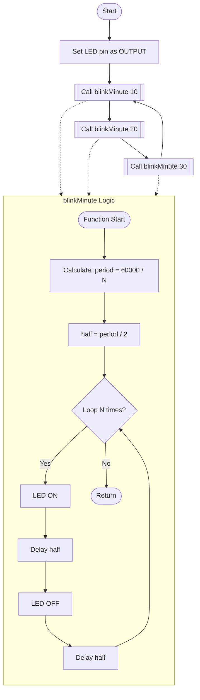
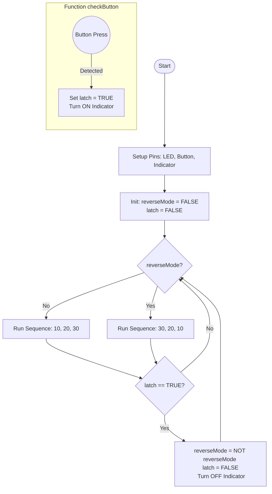

## 🔷 Q1: LED Blinking & Toggle Control using Raspberry Pi Pico

---

### 📌 Problem Statement

We must blink an LED connected to a Raspberry Pi Pico **exactly:**

- **10 times** in the **1st minute**
- **20 times** in the **2nd minute**
- **30 times** in the **3rd minute**

The sequence must maintain **exact 60 seconds per minute** and therefore must compute ON/OFF time mathematically.

After that, we add a **push-button toggle**, which reverses the blink order **only after the complete 3-minute cycle finishes**, not during execution.

- **Normal Mode:** 10 → 20 → 30  
- **Reverse Mode:** 30 → 20 → 10  

---

### 🧠 Approach

- Compute ON–OFF time so that **N blinks = 60 seconds**
- Use a reusable Blink Function
- Use **latching logic** so button press is **stored** and applied **only after the full 3-minute cycle**, preventing mid-cycle pattern change.

---

### 📐 Mathematical Logic

A blink contains two equal parts:

1 Blink = LED ON + LED OFF

Total execution time must satisfy:

$$
\text{Total Time} = N(\text{ON} + \text{OFF}) = 60s
$$

$$
\text{ON} + \text{OFF} = \frac{60}{N}
$$

$$
\text{ON} = \text{OFF} = \frac{60}{2N}
$$

$$
T_{\text{on/off(ms)}} = \frac{60000}{2N}
$$

---

### 🔍 Explanation in Simple Words

| Blinks in 1 minute (N) | Time per blink | ON Time | OFF Time |
|------------------------|----------------|---------|----------|
| 10 | 6 sec | 3 sec | 3 sec |
| 20 | 3 sec | 1.5 sec | 1.5 sec |
| 30 | 2 sec | 1 sec | 1 sec |

⏱️ Therefore, **every combination completes exactly in 60 seconds**, regardless of N.

---

### 💻 Pseudo Code (Blink Logic Only)

```pseudo
FUNCTION blinkMinute(N):
    period = 60000 / N        // total ON + OFF time
    half = period / 2         // ON = OFF
    REPEAT N times:
         LED = ON
         delay(half)
         LED = OFF
         delay(half)
END FUNCTION
```
### Block Diagram


### Full Code (Part-A: Without Button)
```c
#define LED_PIN 15

void blinkMinute(int N) {
  float period = 60000.0 / N;
  float half = period / 2.0;

  for (int i = 0; i < N; i++) {
    digitalWrite(LED_PIN, HIGH);
    delay(half);
    digitalWrite(LED_PIN, LOW);
    delay(half);
  }
}

void setup() {
  pinMode(LED_PIN, OUTPUT);
}

void loop() {
  blinkMinute(10);
  blinkMinute(20);
  blinkMinute(30);
}
```
###  Part-B: Adding Push Button Toggle

---

### 🧩 Problem Statement (Part-B)

Modify the blinking application to include a **toggle button** such that:
- Blink order switches between **10 → 20 → 30** and **30 → 20 → 10**
- The change should occur **only after the current 3-minute cycle finishes**
- Button press must be **remembered (latched)** without holding

---

### 🔌 Push Button Interface

| Feature | Explanation |
|--------|-------------|
| **Pin** | GPIO 14 |
| **Mode** | Input using **internal pull-up** |
| **Press Logic** | Logic LOW (0) when pressed |
| **Memory** | Press is latched until cycle finishes |

Button wiring:

```
GPIO14 ---- Button ---- GND
```

⚠ **No external resistor needed** (uses internal pull-up).

---

### 🧠 Operating Modes

| Mode | Sequence |
|------|----------|
| **Normal** | 10 → 20 → 30 |
| **Reverse** | 30 → 20 → 10 |

---

### 🔐 Latching Logic Explanation

- If the user presses the button **anytime** during blinking, we **store** the event.
- The sequence doesn’t flip instantly.
- After the full 3-minute cycle ends, we check the memory and invert the order.

```pseudo
IF button pressed anytime:
    latch = TRUE

At end of 3 minutes:
    IF latch == TRUE:
        reverse_mode = NOT reverse_mode
        latch = FALSE
```

This guarantees stable behavior and is similar to how **measurement cycles in battery instruments do not change during acquisition.**

---

### 🧮 Math (Same as Part-A)

Blink timing formula remains unchanged:

$$
T_{\text{on/off(ms)}} = \frac{60000}{2N}
$$

Only the value of **N changes dynamically** based on the selected mode (normal or reverse).

---

### Block Diagram



### 💻 Pseudo Code (Toggle Logic)


```pseudo
//--------------------------------------------
// FUNCTION: blinkMinute(N)
// Purpose : Generate exactly N blinks in 60 sec
//--------------------------------------------
FUNCTION blinkMinute(N):
    period = 60000 / N                // full ON+OFF time
    half = period / 2                 // equal ON/OFF time

    REPEAT N times:
         LED = ON
         delay(half)
         checkButton()                // continuously watch for request

         LED = OFF
         delay(half)
         checkButton()

END FUNCTION


//--------------------------------------------
// FUNCTION: checkButton()
// Purpose : Detect press and latch request
//--------------------------------------------
FUNCTION checkButton():
    IF (button == PRESSED) THEN       // LOW because of pull-up
         latch = TRUE
         indicatorLED = ON            // show user that request is saved
    END IF
END FUNCTION


//--------------------------------------------
// OPERATING MODES
//--------------------------------------------
normalSequence  = {10, 20, 30}
reverseSequence = {30, 20, 10}


//--------------------------------------------
// MAIN PROGRAM
//--------------------------------------------
SET LED pin as OUTPUT
SET button pin as INPUT_PULLUP
SET indicatorLED as OUTPUT (initial OFF)

reverseMode = FALSE         // default mode
latch = FALSE               // no toggle request yet

LOOP FOREVER:

    IF reverseMode == FALSE THEN
         currentSeq = normalSequence
    ELSE
         currentSeq = reverseSequence
    END IF

    // Execute 3-minute cycle
    blinkMinute( currentSeq[0] )
    blinkMinute( currentSeq[1] )
    blinkMinute( currentSeq[2] )

    // After cycle completes, apply latch if requested
    IF latch == TRUE THEN
         reverseMode = NOT reverseMode      // toggle mode
         latch = FALSE                      // clear saved request
         indicatorLED = OFF                 // ready for next request
    END IF

END LOOP
```
- The `checkButton()` runs inside the blink loop, so we do NOT need to hold the button.
- Button reading is based on pull-up ⇒ PRESSED = LOW.
- Latch ensures mode change only after a complete timing cycle (3 minutes).
- `indicatorLED` is optional for debug or user feedback.

// ========================================================
//  Q1-B: LED Blinking + Latching Toggle Button (Pico, Arduino)
// ========================================================
//  LED Pattern: 10 → 20 → 30  (Normal Mode)
//  Toggle to:   30 → 20 → 10  (Reverse Mode)
//  Toggle applies ONLY after full 3-minute cycle.
// ========================================================

#define LED_PIN        15   // External LED
#define BUTTON_PIN     14   // Push Button (Input Pull-Up)
#define INDICATOR_LED  25   // Onboard LED (Latch Indicator)

bool reverseMode = false;   // Current mode (Normal = false)
bool latchedPress = false;  // Remembers button press

// --------------------------------------------------------
//  FUNCTION: checkButton()
//  Purpose : Detect press and store request (Latch)
//  NOTE    : LOW = pressed (because of internal pull-up)
// --------------------------------------------------------
void checkButton() {
  if (digitalRead(BUTTON_PIN) == LOW) {
    latchedPress = true;
    digitalWrite(INDICATOR_LED, HIGH); // Show request stored
  }
}

### Complete code
```c
// --------------------------------------------------------
//  FUNCTION: blinkMinute(N)
//  Purpose : Make exactly N blinks in 60 seconds
//  Formula : ON/OFF(ms) = 60000/(2*N)
// --------------------------------------------------------
void blinkMinute(int N) {
  float period = 60000.0 / N;
  float half = period / 2.0;

  for (int i = 0; i < N; i++) {
    digitalWrite(LED_PIN, HIGH);
    delay(half);
    checkButton();           // Check if user pressed

    digitalWrite(LED_PIN, LOW);
    delay(half);
    checkButton();           // Check again
  }
}

// --------------------------------------------------------
//  SETUP
// --------------------------------------------------------
void setup() {
  pinMode(LED_PIN, OUTPUT);
  pinMode(INDICATOR_LED, OUTPUT);
  pinMode(BUTTON_PIN, INPUT_PULLUP);  // No external resistor needed
}

// --------------------------------------------------------
//  MAIN LOOP
// --------------------------------------------------------
void loop() {
  int normal[3]  = {10, 20, 30};
  int reverse[3] = {30, 20, 10};
  int* seq = reverseMode ? reverse : normal;

  // Execute full 3-minute sequence
  blinkMinute(seq[0]);
  blinkMinute(seq[1]);
  blinkMinute(seq[2]);

  // AFTER sequence completes, check if toggle requested
  if (latchedPress) {
    reverseMode = !reverseMode;  // Change mode
    latchedPress = false;        // Clear memory
    digitalWrite(INDICATOR_LED, LOW); // Turn off indicator
  }
}
```


```
