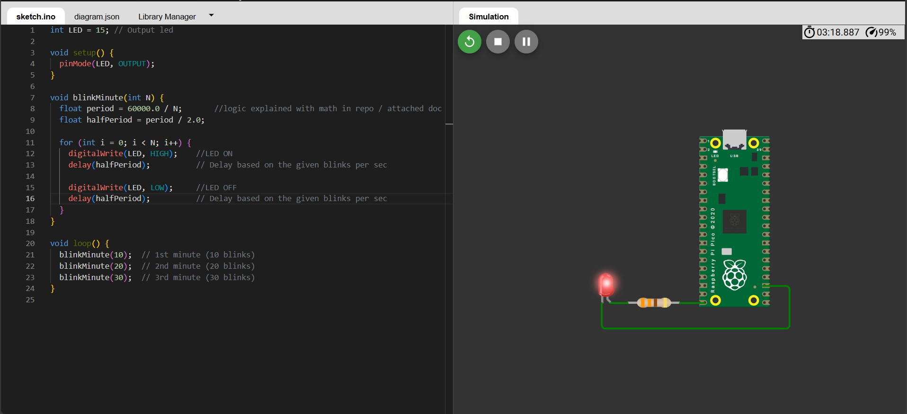
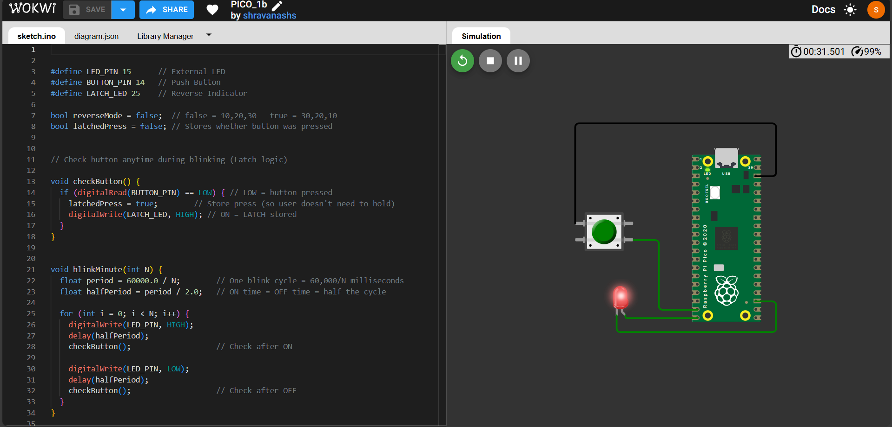
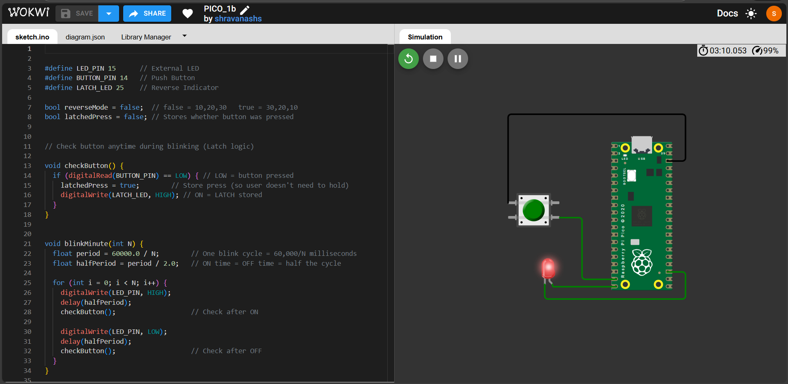
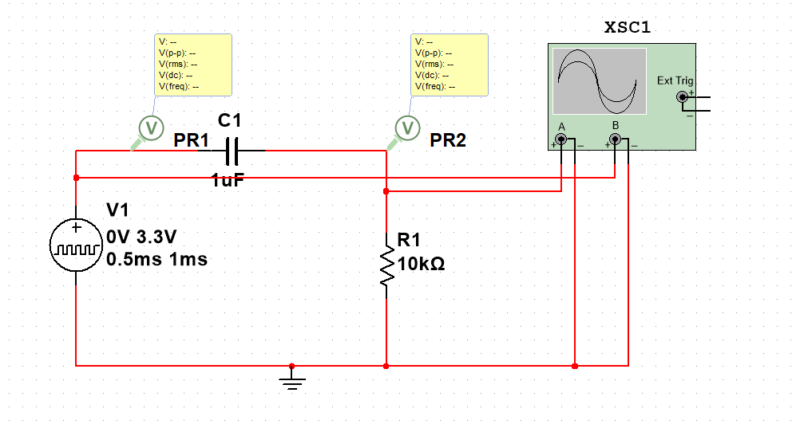
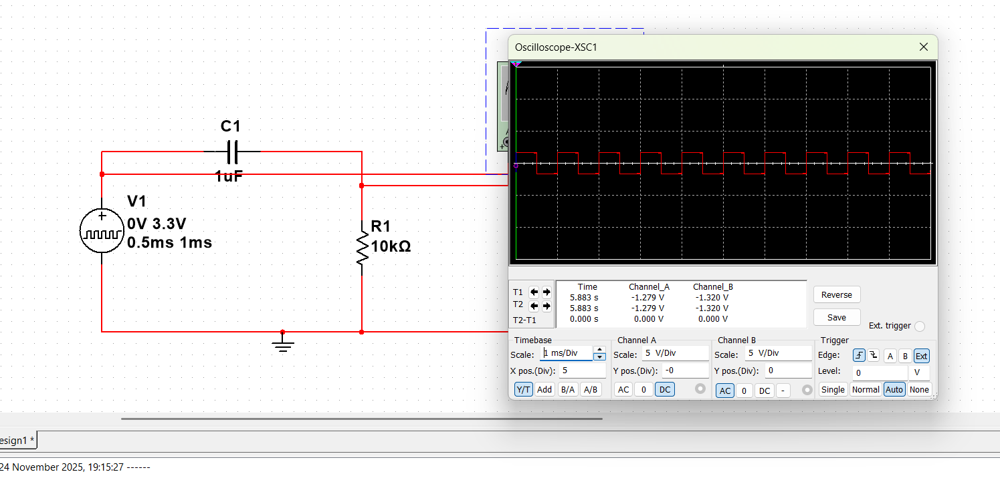
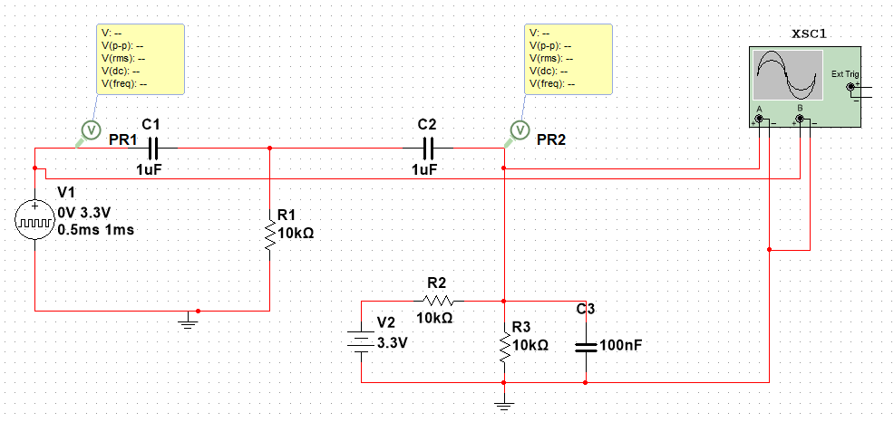
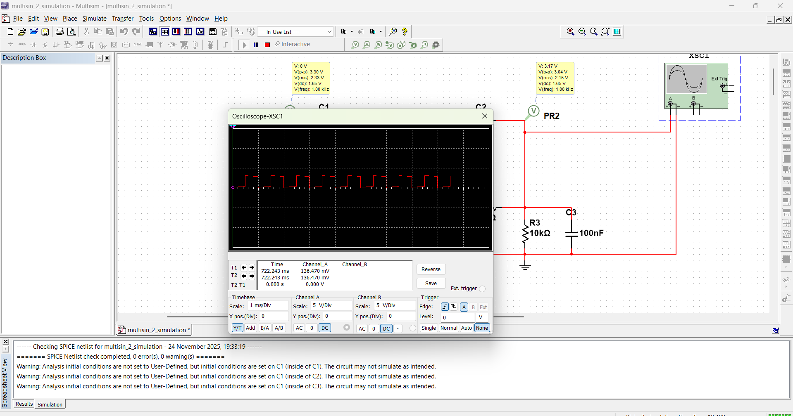
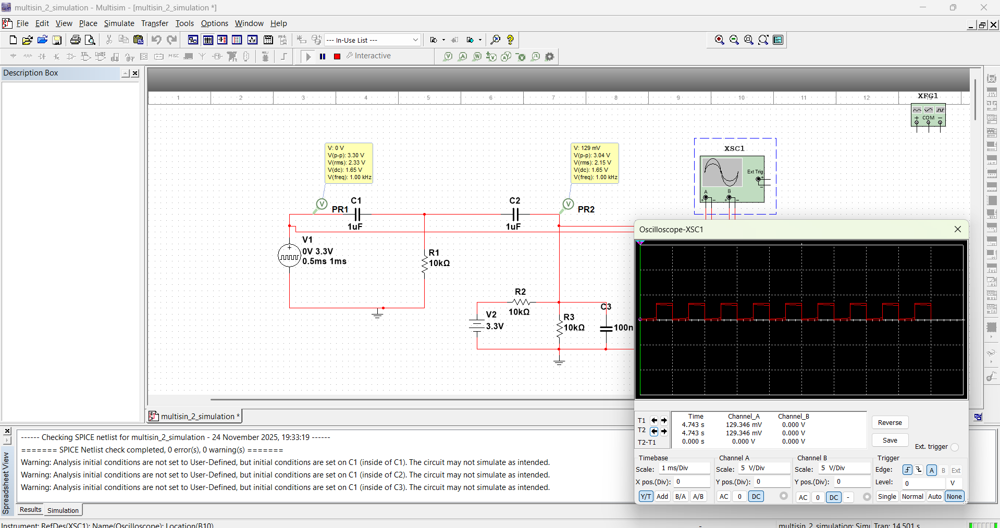

# 🔋 ThinkClock Battery R&D Assignment

This repository contains three embedded battery-centric engineering tasks involving:
- **Raspberry Pi Pico LED sequencing with latch logic**
- **Passive PWM level shifting using RC networks**
- **Battery pack topology comparison with BMS impact**

---

## 📌 Summary Table

| Question | Problem Statement | Explanation | Simulation |
|----------|------------------|-------------|-------------|
| **Q1** | Blink LED on Raspberry Pi Pico exactly **10, 20, 30 times per minute**, with button-latch toggle | [View Explanation](./question1.md) | *(Add link)* |
| **Q2** | Level shift **0–3.3V PWM** to **±1.65 V**, then convert back to **0–3.3 V** using only RC circuits | [View Explanation](./question2.md) | [multisim](https://github.com/ShravanaHS/assignment/blob/main/multisin_2_simulation.ms14) |
| **Q3** | Compare **two battery pack topologies** and relate their effects on **BMS balancing and safety** | [View Explanation](./question3.md) | N/A |

---

## 🔷 Q1 – LED Pattern with Toggle (Raspberry Pi Pico)

> Figures demonstrate LED blinking sequence and latch-based mode reversal.

#### 🟢 Normal 10 → 20 → 30 Blinking

🔗 *Simulation:* *(Add Link)*

---

#### 🔵 Button Press Detected (Latch ON)

🔗 *Simulation:* *(Add Link)*

---

#### 🔻 Reverse Pattern 30 → 20 → 10

🔗 *Simulation:* *(Add Link)*

---

## 🔷 Q2 – PWM Passive Level Shifting (RC Networks)

### 🟡 Stage-1: 0–3.3 V → −1.65 to +1.65 V (High-Pass)

**Schematic**
 

**Waveform**
 

🔗 *Simulation:* *(https://github.com/ShravanaHS/assignment/blob/main/multisin_2_simulation.ms14)*

---

### 🔵 Stage-2: Re-Center to 0–3.3V Using DC Bias

**Schematic**
 

**Waveform**
 

🔗 *Simulation:* *(https://github.com/ShravanaHS/assignment/blob/main/multisin_2_simulation.ms14)*

---

📝 **Final Output Comparison**
 

---

## 🧠 Key Highlights

| Feature | Explanation |
|---------|-------------|
| **Latch-based control** | Mode changes only after the ongoing timing window ends (common in test instruments). |
| **Passive level shifting** | Uses AC coupling + DC biasing without op-amps; very cost-effective. |
| **Pack topology & BMS** | Topology impacts BMS balancing complexity, fault isolation, and safety. |

---

## 🛠️ Tools Used
- **Raspberry Pi Pico (C/C++)**
- **Multisim / LTSpice (Analog simulation)**
- **Wokwi (Digital simulation)**
- **Markdown + Mermaid (Documentation)**

---

### 👨‍🔬 Author  
**Shravana H S**  
📧 *shravanahs97@gmail.com*

---

