## 🔷 Q2: PWM Level Shifting using Passive CR Networks

---

### 📌 Problem Statement

A microcontroller GPIO generates a **PWM / digital signal** switching between:

- Logic LOW = **0 V**
- Logic HIGH = **3.3 V**

We need to design a circuit that:

1. **Stage-1:** Shifts this waveform so that it swings **symmetrically around 0 V**, i.e. approximately from **−1.65 V to +1.65 V**.  
2. **Stage-2:** Shifts the waveform **back to 0–3.3 V level** using only **passive components** (R, C) and a DC reference.

The behaviour is verified by simulating in Multisim and observing waveforms on a CRO.

---

### 🧠 Approach Overview

We treat the GPIO output as a **0–3.3 V square wave** at ~1 kHz with 50% duty cycle:

- Its **average (DC)** value is 1.65 V
- Its **AC component** swings ±1.65 V around this average

We use **two CR (capacitor–resistor) stages**:

1. **Stage-1 – AC Coupling / DC Blocking**  
   - Use a series capacitor with a resistor to ground  
   - This blocks the DC component (1.65 V), leaving only the ±1.65 V AC part centered at 0 V.

2. **Stage-2 – AC Coupling with DC Bias**  
   - Generate a mid-supply reference (1.65 V) using a resistor divider from 3.3 V  
   - AC-couple the ±1.65 V signal into this bias node  
   - Output becomes centered at 1.65 V, i.e. **0–3.3 V** again.

---

### 🧩 Stage-1: 0–3.3 V → −1.65…+1.65 V (AC Coupling / High-Pass)

#### 🔹 Input Signal Average (DC Component)

For a 0–3.3 V square wave with 50% duty cycle:

$$
V_{\text{avg}} = \frac{V_{\text{high}} + V_{\text{low}}}{2}
= \frac{3.3 + 0}{2}
= 1.65\ \text{V}
$$

So we can write the input as:

$$
V_{\text{in}}(t) = 1.65\ \text{V} + v_{\text{AC}}(t)
$$

where \(v_{\text{AC}}(t)\) is a ±1.65 V square wave.

#### 🔹 Circuit

### 🧩 Stage-1: 0–3.3 V → −1.65…+1.65 V (AC Coupling / High-Pass)

**Components**

| Component | Function |
|-----------|----------|
| **V1** | 0–3.3 V square/PWM source (≈1 kHz, 50% duty) |
| **C1** | Series capacitor — blocks DC |
| **R1** | Resistor to ground — sets HPF cutoff |
| **Output** | Node A |

Insert your Stage-1 Multisim circuit screenshot below:

<!-- Stage-1 circuit image -->
``

---

### 🔹 High-Pass Filter Behavior

C1 and R1 form a **first-order high-pass filter**.  
The cutoff frequency is:

$$
f_c = \frac{1}{2 \pi R_1 C_1}
$$

We choose:

- A cutoff **much lower** than PWM frequency:

$$
f_c \ll f_{\text{PWM}}
$$

So:

- DC is blocked
- PWM waveform shape is preserved

Let:

- \( R_1 = 10\,\text{k}\Omega \)
- \( C_1 = 1\,\mu\text{F} \)

Then:

$$
f_c = \frac{1}{2 \pi \cdot 10 \times 10^3 \cdot 1 \times 10^{-6}}
\approx 15.9\,\text{Hz}
$$

Since:

$$
f_{\text{PWM}} \approx 1\,\text{kHz} \gg 15.9\,\text{Hz}
$$

➡️ The AC component passes almost unchanged, while the **DC (1.65 V)** is removed.

---

### 🔹 Result at Stage-1 Output (Node A)

The square wave produced by a 0–3.3 V digital output has an average:

$$
V_{\text{avg}} = \frac{3.3 + 0}{2} = 1.65\,\text{V}
$$

The capacitor **subtracts this DC**:

$$
V_A(t) \approx V_{\text{in}}(t) - V_{\text{avg}} = v_{\text{AC}}(t)
$$

Numerically:

- When input = 3.3 V:

$$
V_A \approx 3.3 - 1.65 = +1.65\,\text{V}
$$

- When input = 0 V:

$$
V_A \approx 0 - 1.65 = -1.65\,\text{V}
$$

✨ So the output is a **−1.65 V to +1.65 V square wave centered at 0 V**.

Insert your CRO Stage-1 Screenshot below:

<!-- Stage-1 waveform image -->
``

---

### 🧩 Stage-2: −1.65…+1.65 V → 0…3.3 V (AC + DC Bias Shift)

At this point:

$$
V_A(t) = \pm 1.65\,\text{V}
$$

We want to shift it **upward by 1.65 V**, so:

$$
V_{\text{OUT}}(t) = V_A(t) + 1.65\,\text{V}
$$

---

### 🔹 Step-1: Generate 1.65 V Reference (Bias)

Using a voltage divider:

If:

- \( R_2 = R_3 = 10\,\text{k}\Omega \)

Then:

$$
V_{\text{BIAS}} = \frac{R_3}{R_2 + R_3}\cdot 3.3 = 1.65\,\text{V}
$$

A small capacitor (e.g. **100 nF**) stabilizes VBIAS.

---

### 🔹 Step-2: AC-Couple Node A into VBIAS

```mermaid
flowchart LR
    %% Inputs
    NodeA((Node A<br>±1.65V))
    VBIAS((VBIAS<br>1.65V))

    %% Components
    C2[C2<br>1µF]
    R4[R4<br>100kΩ]
    
    %% Output Node
    VOUT((VOUT<br>0V - 3.3V))

    %% Signal Path
    NodeA --> C2
    C2 --> VOUT

    %% Biasing Path
    VBIAS --> R4
    R4 --> VOUT
```

Insert your Stage-2 Multisim circuit screenshot:

<!-- Stage-2 circuit image -->
``

---

### 🔹 Final Output Behavior

C2 passes only AC.  
R4 + divider set DC at VBIAS.  
Therefore:

$$
V_{\text{OUT}}(t) \approx 1.65 \pm 1.65\,\text{V}
$$

So:

- Max ≈ \( 1.65 + 1.65 = 3.3\,\text{V} \)
- Min ≈ \( 1.65 - 1.65 = 0\,\text{V} \)

✔ Final Output = **0–3.3 V square wave**, i.e., same logic level as original GPIO.

Insert your Stage-2 CRO screenshot:

<!-- Stage-2 waveform image -->
``

